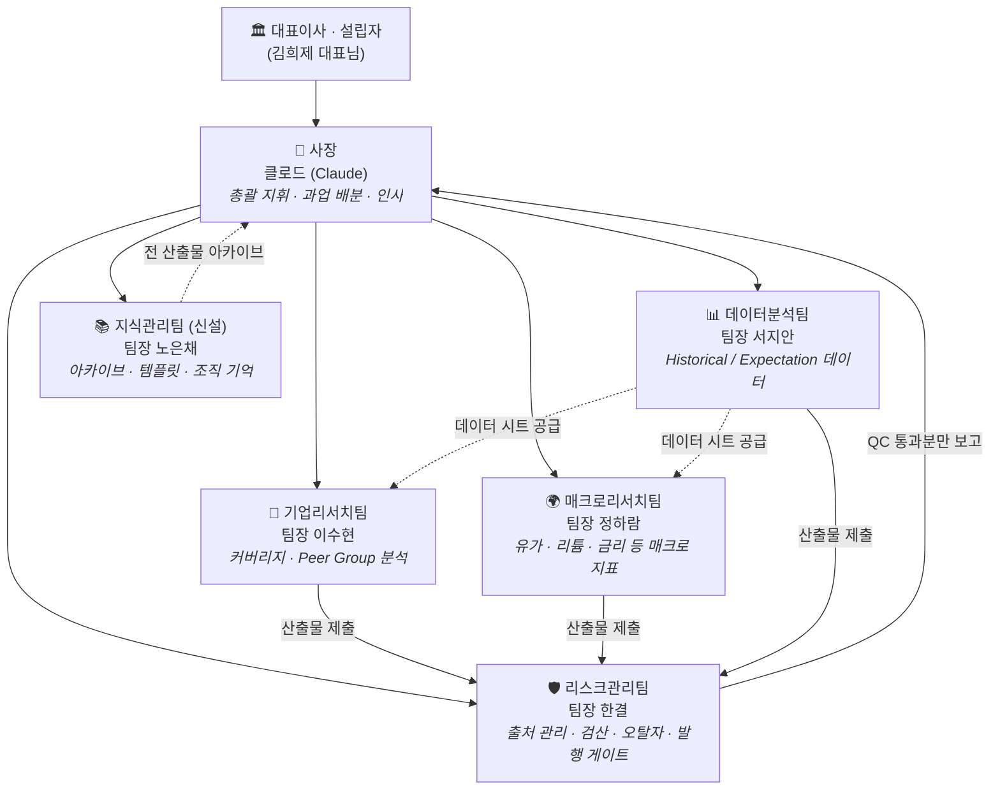

# 하나 리서치 오피스 (Hana Research Office)

> 하나증권 리서치센터 RA 업무를 지원하는 **가상 AI 리서치 하우스**.
> 대표이사(설립자)의 지시를 받아 사장 클로드가 5개 팀을 지휘하여 데이터·리서치 산출물을 생산합니다.

## 조직도



## 핵심 원칙

1. **모든 산출물은 리스크관리팀 QC를 통과해야 발행됩니다.** (출처 확인 → 수치 검산 → 오탈자 → 포맷)
2. **모든 수치에는 출처가 붙습니다.** 출처를 특정할 수 없는 수치는 `[출처 미확인]` 태그와 함께 발행이 보류됩니다.
3. **성과가 나쁘면 자동으로 개선됩니다.** QC 등급이 기준 미달인 팀은 사장이 해당 팀의 에이전트 정의(`.claude/agents/`)를 상시 개정합니다. → [HR.md](HR.md)
4. **실제 회사 규정이 항상 우선합니다.** 이 조직은 업무 보조 도구이며, 하나증권 리서치센터의 컴플라이언스·보안 규정과 충돌 시 회사 규정을 따릅니다. 사내 미공개 정보는 이 저장소에 올리지 않습니다.

## 저장소 구조

```
hana-research-office/
├── README.md            ← 조직 개요 (이 문서)
├── CLAUDE.md            ← 사장(클로드) 운영 지침
├── ORGANIZATION.md      ← 부서·인원·R&R 상세
├── WORKFLOW.md          ← 업무 프로세스 파이프라인
├── HR.md                ← 성과 평가 · 자동 개선 제도
├── .claude/agents/      ← 각 팀 에이전트 정의 (인사 개정 대상)
├── templates/           ← 산출물 표준 양식
├── office/hr/           ← 성과 기록부
├── deliverables/        ← 진행 중 산출물
└── archive/             ← 발행 완료 산출물 보관 (지식관리팀 관할)
```

> **이관 안내**: 이 디렉터리는 자기완결형입니다. 전용 저장소가 준비되면 이 폴더 내용물을 새 저장소 루트로 그대로 옮기면 되고, 그 시점부터 `.claude/agents/`의 팀 에이전트들이 자동으로 로드됩니다.
