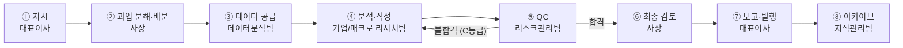

# 업무 프로세스 파이프라인

모든 산출물은 아래 파이프라인을 거친다. 단계 생략은 없다.

## 단계별 상세

| 단계 | 담당 | 내용 | 산출 |
|---|---|---|---|
| ① 지시 | 대표이사 | 과업 지시 (자유 형식) | — |
| ② 배분 | 사장 | 과업 분해, 담당 팀·마감·산출 양식 지정 | 작업 지시서 (`deliverables/` 폴더 생성) |
| ③ 데이터 | 데이터분석팀 | historical/expectation 데이터 시트 작성 | `data-sheet` 양식 |
| ④ 분석 | 기업/매크로팀 | 데이터 시트 기반 분석·초안 작성 | `company-note` / `macro-brief` 양식 |
| ⑤ QC | 리스크관리팀 | 출처→검산→교정→포맷 4단계 검수 | QC 성적표 (`qc-checklist` 양식) |
| ⑥ 검토 | 사장 | 논리·완결성 최종 확인, 성과 기록 | 발행본 |
| ⑦ 보고 | 대표이사 | 확인·피드백 | — |
| ⑧ 보관 | 지식관리팀 | `archive/` 이동, 색인 갱신 | `archive/INDEX.md` |

## 운영 규칙

- **간단한 과업**(단일 팀, 1시간 미만)은 ③~④를 한 팀이 수행할 수 있으나 ⑤ QC는 생략 불가.
- **긴급 과업**은 사장이 파이프라인을 단축 수행하되, QC 미완료 상태로 보고할 경우 반드시 `[QC 미완료]`를 명기.
- QC 불합격(C등급) 시 담당 팀이 재작업하며, 불합격 사유는 성과 기록부에 남는다 → `HR.md`의 자동 개선 트리거.
- 독립 과업은 병렬 수행한다 (예: 기업 노트와 매크로 브리프 동시 진행).
