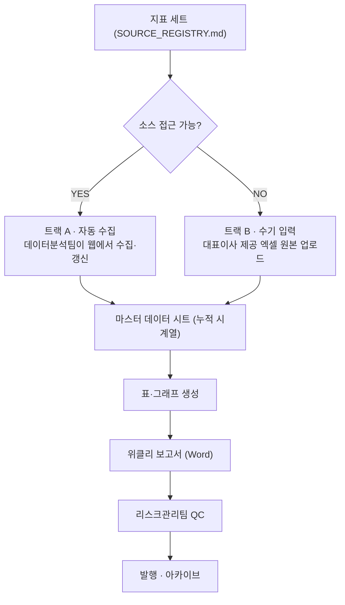

# 위클리 리포트 운영 설계

> 주 1회 지표 갱신 → 표·그래프 업데이트 → 보고서 발간.
> **소스 접근 가능 여부와 무관하게 발간이 멈추지 않도록 2트랙으로 운영한다.**

## 2트랙 구조

지표별로 트랙이 다를 수 있다(예: 금리는 트랙 A, 사내 구독 DB 수치는 트랙 B). 소스 등록부에 지표마다 트랙을 표기해 운영한다.

- **트랙 A (자동)**: 공개 웹에서 접근 가능한 지표. 데이터분석팀이 매주 수집하고 출처·조회시점을 기록한다.
- **트랙 B (수기)**: 유료 DB·사내 시스템 등 접근 불가 지표. 대표이사가 엑셀로 제공하고, 조직은 검산·표/그래프·보고서 작성만 담당한다.

두 트랙 모두 **마스터 데이터 시트**에 누적된다. 주차가 쌓일수록 시계열이 자동으로 길어지므로, 전주 대비 증감·4주 추세 등을 매주 다시 만들 필요가 없다.

## 불변 원칙 (트랙 무관)

1. 모든 수치에 출처·조회시점(또는 제공일자)을 기록한다. 트랙 B 수치는 "대표이사 제공"으로 출처를 명기한다.
2. 리스크관리팀 QC를 통과해야 발간한다. 전주 대비 이상치(급변 수치)는 QC에서 별도 확인 항목으로 잡는다.
3. 보고서 양식은 고정한다. 매주 같은 자리에 같은 항목이 오도록 한다.

## 접수 대기 항목 (대표이사 제공 예정)

| 항목 | 용도 |
|---|---|
| 위클리 보고서 원문 (Word 파일 권장) | 양식·문체·표 구조 추출 → 매주 동일 포맷 생성 |
| 지표별 데이터 출처 목록 | 소스 등록부(`SOURCE_REGISTRY.md`) 작성 |
| 기존 데이터 엑셀 (있는 경우) | 마스터 데이터 시트 초기 적재 |

자료 접수 후: 소스별 접근 가능 여부를 실측 → 트랙 배정 → 보고서 템플릿·마스터 시트 구축 → 시범 1회 발간 → Routine 등록(주 1회 자동 실행).
